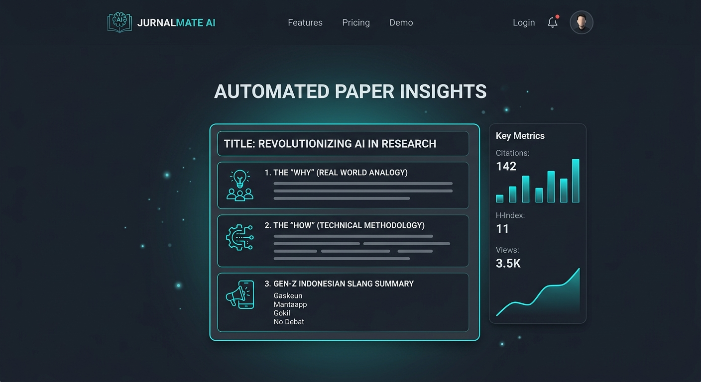

# JurnalMate AI 🎓✨
> **Asisten Literature Review Terbaik untuk Mahasiswa & Peneliti Muda!**

JurnalMate AI adalah asisten literature review dan penganalisis paper ilmiah bertenaga AI yang ramah, cepat, dan mumpuni. Didesain khusus oleh **Senior Research Assistant & Technical Simplifier**, aplikasi ini didedikasikan untuk membantu mahasiswa dan peneliti pemula mendeconstruct naskah akademik/jurnal internasional super rumit menjadi rujukan skripsi/literatur relevan dengan format terstruktur yang renyah dan berbobot dalam hitungan detik.



---

## 🎯 Mengapa JurnalMate AI Berbeda?
Kami membuang semua jargon rumit akademis dan menstruktur analisis jurnal ke dalam **5 Pilar Analisis Intuitif** yang ramah dikonsumsi untuk pembuatan Bab 1, Bab 2, dan Bab 4 skripsi Anda:

1. **THE "WHY" (Problem Context):** Penjelasan lugas mengenai urgensi masalah teoretis atau dunia nyata yang disasar peneliti menggunakan analogi kehidupan nyata yang sangat mudah dicerna.
2. **THE "HOW" (Methodology):** Pembongkaran taktis terhadap desain eksperimen, arsitektur model (seperti CNN, MobileNet, BERT), dan logika pemilihan metrik agar Anda paham rute ilmiahnya.
3. **THE "RESULTS" (The Tea):** Pemotongan jargon teoretis untuk langsung memberikan performansi nyata model (akurasi, F1-Score, RMSE) dan pembuktian apakah naskah ini betul-betul lebih unggul dari teori terdahulu.
4. **THE "CRITIQUE" (Be Skeptical):** Menarik perhatian Anda pada batasan tersirat (fine-print) atau keterbatasan cakupan yang dilaporkan penulis demi kehati-hatian akademik.
5. **GEN-Z SUMMARY:** Ringkasan santai tapi profesional setebal 2 kalimat menggunakan slang Indonesia sehari-hari (*"Intinya..."*, *"Jujurly..."*) untuk tangkapan super kilat.

---

## 🌟 Fitur Utama Aplikasi

- 🔍 **Academic Graph Real-Time Integration:** Pencarian terintegrasi legal dengan miliaran dataset naskah dari **Semantic Scholar Academic Graph API** dan **OpenAlex Discovery API**.
- 📊 **Skor Relevansi Dinamis (0–100%):** Kalkulator kecocokan cerdas yang mempertimbangkan orisinalitas abstrak, ornamen kata kunci pengguna, reputasi rujukan, serta tahun rilis.
- 💬 **Penyusun Ringkasan Cerdas Bahasa Indonesia:** Ditenagai oleh **Gemini AI SDK** dengan sistem fallback komparatif teruji—menjamin summary Anda selalu tampil berbobot bahkan saat API utama sibuk atau kuota terbatas.
- 📝 **Copy-Paste Generator Sitasi Akademik:** Buat kutipan instan berformat **APA 7th, IEEE, atau MLA 9th Edition** langsung dari metadata orisinal paper pilihan.
- 💾 **Perpustakaan Saved Papers (Bookmarks Lokal):** Simpan semua paper favorit Anda dengan aman langsung ke dalam browser penyimpanan lokal, tanpa perlu ribet mendaftar akun atau login.
- 📥 **Pengunduh PDF Open-Access Resmi:** Akses download cepat nan aman satu-klik untuk paper yang terdaftar memiliki rilis PDF Open Access berlisensi legal.

---

## 🛠️ Tech Stack & Arsitektur

* **Lapis Frontend:** React (Vite Host), TypeScript (Strict Mode), Tailwind CSS, Lucide Icons, dan Motion (untuk transisi halaman nan mulus).
* **Lapis Backend:** Node.js, Express (API Proxy untuk pencegah kebocoran API Key di peramban), tsx compiler, esbuild bundler, dan Google GenAI SDK.
* **AI Core:** Google Gemini AI API dengan model tangguh (`gemini-3.5-flash` & fallback dinamis).

---

## 🚀 Panduan Ekspor & Cara Commit ke GitHub

Projek ini dikembangkan secara instan di dalam Google AI Studio Workspace. Untuk mempublikasikan dan melakukan commit kode Anda ke **GitHub**, Anda dapat mengikuti panduan mudah berikut:

### Metode 1: Menggunakan settings menu AI Studio (Cara Paling Instan)
1. Buka workspace **Google AI Studio Build** Anda.
2. Di pojok kanan atas, temukan dan klik **Settings Menu** (ikon gerigi).
3. Pilih opsi **Export to GitHub**.
4. Hubungkan akun GitHub Anda (jika belum pernah melakukannya), berikan izin akses, pilih nama repositori baru, lalu tekan **Export**. 
5. Repositori GitHub Anda akan secara otomatis terisi dengan seluruh source-code terbaru JurnalMate AI ini lengkap dengan file README visual ini!

### Metode 2: Secara Manual Melalui Terminal Git Lokal Anda
Jika Anda telah mengunduh ZIP project ini ke komputer lokal, ikuti langkah-langkah git standar berikut:

```bash
# 1. Masuk ke folder unduhan ekstraksi project
cd jurnalmate-ai

# 2. Inisialisasi git lokal
git init

# 3. Hubungkan ke repositori GitHub baru Anda
git remote add origin https://github.com/USERNAME_ANDA/REPOS_NAMA_ANDA.git

# 4. Tambahkan seluruh berkas ke stage
git add .

# 5. Lakukan commit perdana
git commit -m "feat: inisialisasi JurnalMate AI - Asisten Literatur Akademik Gemini"

# 6. Set nama branch utama ke 'main'
git branch -M main

# 7. Push kode Anda ke repositori GitHub
git push -u origin main
```

---

## 💻 Panduan Menjalankan di Komputer Lokal

### 1. Kloning & Instalasi Paket Dependensi
```bash
# Selesai melakukan clone/download, buka terminal lalu jalankan:
npm install
```

### 2. Setup Kredensial Lingkungan (Environment Variables)
Ubah nama berkas `.env.example` di baris utama menjadi `.env` lalu isi kata sandinya:
```env
# .env
GEMINI_API_KEY="ISI_DENGAN_API_KEY_GEMINI_ANDA"
GEMINI_MODEL="gemini-3.5-flash"
PORT=3000
```

### 3. Luncurkan Server Development
```bash
npm run dev
```
Buka browser Anda dan akses tautan `http://localhost:3000` untuk mulai menjelajah jurnal.

---

## 📄 Kebijakan & Etika Riset (Disclaimer)
* JurnalMate AI berkomitmen menjaga hak cipta orisinal naskah. Seluruh PDF bersumber legal dari data API Open Access publik.
* Ringkasan dari kecerdasan buatan dirancang sebagai pintu gerbang bantu mahasiswa memahami konteks secara komparatif. Selalu cross-check naskah utama orisinal sebelum mencantumkannya ke dalam kutipan skripsi resmi!
